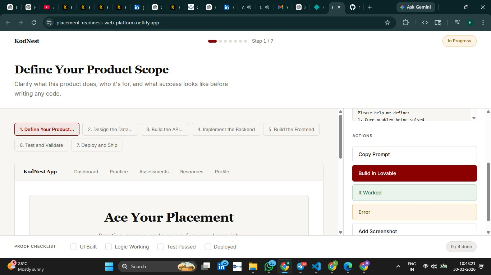

# Placement Readiness Platform

> An AI-powered web application designed to analyze job descriptions, extract skills, generate interview preparation plans, and guide users through a structured placement readiness workflow.

The Placement Readiness Platform is an intelligent system that helps students prepare for placements by analyzing job descriptions (JD) and generating personalized preparation strategies.

It combines frontend engineering, intelligent heuristics, and structured workflows to simulate real-world hiring processes.

---

## ⚠️ Important Note

This repository contains the core implementation of the Placement Readiness Platform.

Some experimental features, datasets, and development iterations are excluded to keep the repository clean and production-ready.

Only essential components required to demonstrate functionality and system design are included.

---

## Project Overview

Preparing for placements involves multiple steps — understanding job requirements, preparing skills, practicing interviews, and tracking progress.

This platform simplifies the entire process by:

- Extracting skills from job descriptions  
- Generating structured preparation plans  
- Mapping interview rounds dynamically  
- Providing readiness scoring and tracking  

---

## Problem Statement

Students often face difficulty in:

- Understanding job requirements from JDs  
- Knowing what to prepare  
- Structuring their preparation effectively  
- Tracking their readiness progress  

This platform solves these issues by offering an end-to-end guided system.

---

## Live Website

https://placement-readiness-web-platform.netlify.app/

---

## 📸 Application Screenshot

### Home / Step 1 – Define Product Scope

---

## High-Level System Architecture

User inputs Job Description (JD)  
↓  
Skill Extraction Engine  
↓  
Categorization (Core, Web, Data, etc.)  
↓  
Company Intelligence Heuristics  
↓  
Round Mapping Engine  
↓  
Preparation Plan Generator  
↓  
Checklist + Readiness Score  
↓  
Results displayed to user  

---

## Application Screens

1. JD Analysis  
- Paste job description  
- Extract skills automatically  

2. Skill Breakdown  
- Categorized skills (Core, Web, Data, etc.)  
- Interactive toggles  

3. Round Mapping  
- Dynamic rounds based on company type  
- Enterprise vs Startup flows  

4. Preparation Plan  
- 7-day structured roadmap  
- Interview questions  

5. Test & Validation  
- Built-in checklist system  
- Progress tracking  

6. Deploy & Ship  
- Unlock deployment only after all tests pass  

---

## System Architecture

- Frontend: React + Vite  
- Styling: Tailwind CSS  
- State Management: React Hooks  
- Storage: LocalStorage (for persistence)  
- Build Tool: Vite  
- Deployment: Netlify  

---

## Working Process

1. User pastes a Job Description  
2. System extracts skills and categorizes them  
3. Company intelligence is inferred heuristically  
4. Interview rounds are generated dynamically  
5. Preparation plan and questions are created  
6. User tracks progress via checklist  
7. Deployment unlocks after validation  

---

## Technologies Used

- React.js  
- TypeScript  
- Tailwind CSS  
- Vite  
- JavaScript  
- LocalStorage  
- Netlify  

---

## Features

- Skill extraction from JD  
- Dynamic round mapping  
- Company intelligence (heuristics-based)  
- 7-day preparation plan  
- Interview question generator  
- Readiness scoring system  
- Built-in validation checklist  
- Persistent state (localStorage)  
- Deployment lock system  

---

## 📁 Repository Structure

    UI-System-Builder/
    │
    ├── artifacts/
    │   └── kodnest/
    │       ├── src/
    │       │   ├── components/
    │       │   ├── pages/
    │       │   ├── hooks/
    │       │   ├── lib/
    │       │
    │       ├── public/
    │       ├── index.html
    │       ├── vite.config.ts
    │       └── package.json
    │
    ├── attached_assets/
    ├── package.json
    └── README.md

---

## Results

The platform demonstrates how job descriptions can be transformed into structured preparation plans and interview workflows, helping students systematically improve their placement readiness.

---

## Author

HARSHITHA M V  

Final Year Engineering Student  

---

## Research Interests

- Artificial Intelligence  
- Machine Learning  
- Career Tech Platforms  
- Full Stack Development  
- Intelligent Web Systems  

---

## Future Enhancements

- AI-based NLP for JD parsing  
- Resume analysis integration  
- Mock interview simulator  
- Backend + database integration  
- User authentication  
